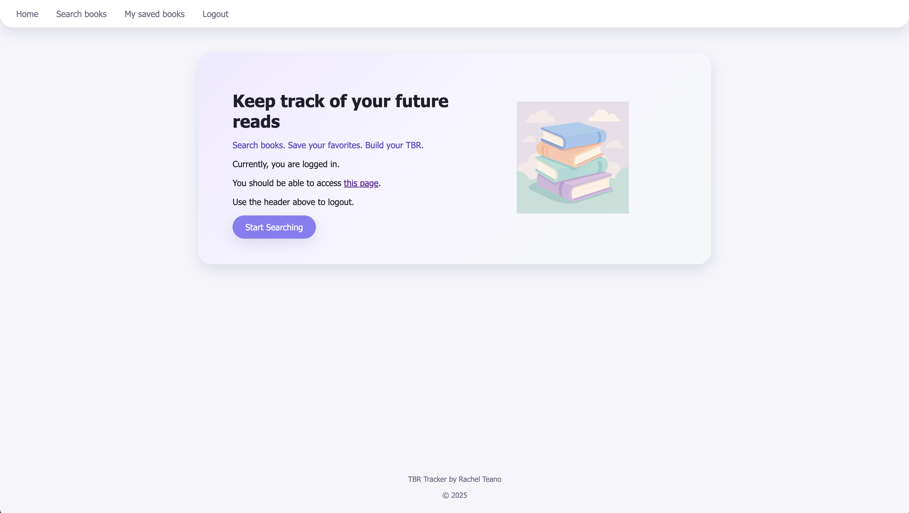
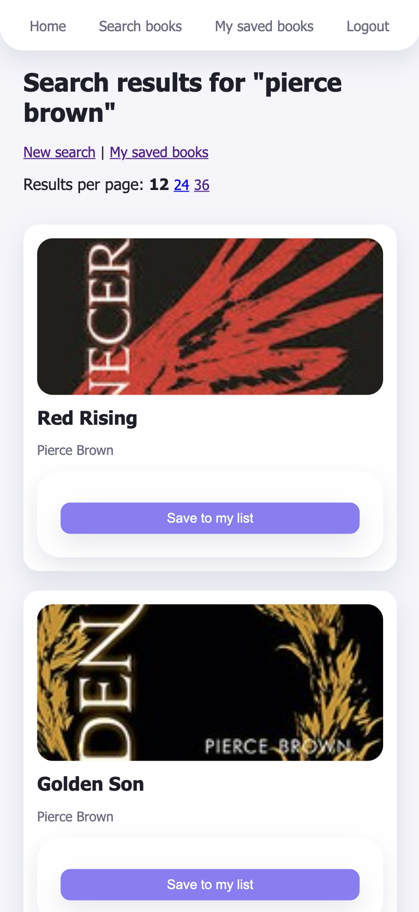
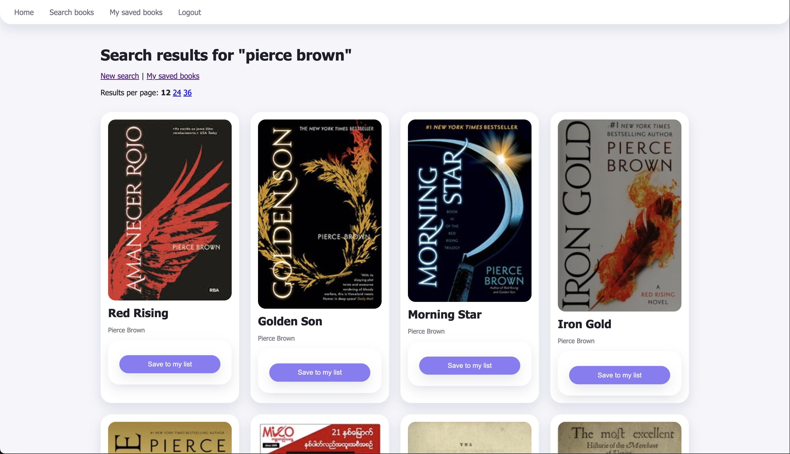

# TBR Tracker
A simple, mobile-responsive book tracking app built with Node, Express, Handlebars, and MySQL, allowing users to search books via the Open Library API and save titles to their reading list.

## Features
- Search for books using the Open Library API || https://openlibrary.org/developers/api
- Save books to your personal TBR (To Be Read) list
- Mark saved books as favorites
- Delete books from your saved list
- Modern, responsive UI styled with custom CSS and pastel desgin
- Uses MVC architecture
- Uses MYSQL + JawsDB (for Heroku deployment)
- Authenticaion using sessions (login/signup)
- Default book cover image for missing thumbnails

## Tech Stack
### Backend
- Node.js
- Express.js
- MySQL2
- express-session
- express-mysql-session

### Frontend
- Handlebars (hbs)
- Custom CSS
- Responsive layout + grid system

## Screenshots

## Author
- Rachel Teano
- Graduate Student
- MMC 6278 Advanced Web Topics 2: Special Topics

